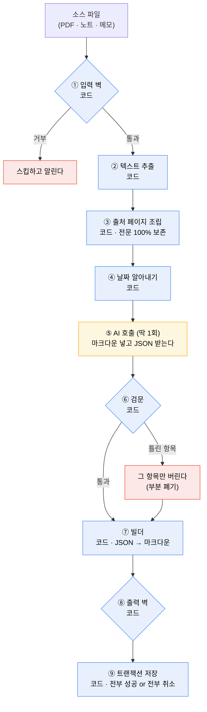

# 파이프라인 설명서

자료를 넣으면 위키가 만들어지는 과정을 그림으로 설명한다.

- **왜 이렇게 정했는가**는 [ADR-0002](adr/0002-agentic-pipeline.md) 에 있다.
- **프론트매터 필드별 상세**는 [reference/frontmatter.md](reference/frontmatter.md) 에 있다.
- 이 문서는 **무엇이 어떻게 돌아가는가**만 다룬다.

---

## 한 줄로 말하면

**AI 는 판단만 하고, 파일은 코드가 쓴다.**

AI 에게 "위키 파일을 만들어라"라고 시키지 않는다. "이 자료에서 무엇을 뽑을지 JSON 으로 알려달라"고 하고, 그 JSON 을 코드가 마크다운으로 조립한다.

---

## 한 장으로 보기



**노란 칸이 AI 이고 나머지는 전부 코드다.** AI 를 부르는 곳이 딱 한 군데뿐이다.

---

## PDF 하나를 넣으면 무슨 일이 벌어지나

### 넣기 전

```
내 볼트/
├── 회의/
│   └── 2026-09-01.md          내가 쓴 노트
└── wiki/
    └── 박서준.md               이미 만들어진 위키
```

사용자가 `회의록-0901.pdf` 를 앱에 끌어다 놓는다.

### 넣은 후

```
내 볼트/
├── 회의/
│   └── 2026-09-01.md
├── sources/
│   └── 회의록-0901.pdf         ★ 원본이 복사되어 보관된다
└── wiki/
    ├── sources/
    │   └── @회의록-0901.md      ★ 추출한 전문이 여기 들어간다
    ├── 박서준.md
    └── 김대리.md                ★ 새로 만들어진 위키
```

**파일이 셋 생겼다.** 각각을 열어 보면 이렇다.

### `sources/회의록-0901.pdf`

원본 그대로다. 우리가 손대지 않는다.

### `wiki/sources/@회의록-0901.md` — 출처 페이지

```markdown
---
type: source
raw: "[[sources/회의록-0901.pdf]]"
raw_hash: 01643e28
date: 2026-09-01
created: 2026-09-10
---

# 회의록-0901

![[sources/회의록-0901.pdf]]

## 추출 전문

(1페이지)
2026년 9월 1일 제품 회의. 참석자 박서준, 김대리, 왕민.
김대리가 QA 리뷰 결과를 발표함. 치명 결함 0건.
서버 장애 건은 다음 주로 연기하기로 했다.

(2페이지)
...
```

**요약이 아니라 전문이다.** PDF 안의 글자를 하나도 버리지 않는다. 나중에 "그 표에 뭐라고 적혀 있었지?"를 검색할 수 있어야 하기 때문이다.

`raw_hash` 는 이 PDF 를 처리했을 당시의 지문이다. 같은 파일을 또 넣으면 지문을 비교해서 건너뛴다.

### `wiki/김대리.md` — 주제 페이지

```markdown
---
aliases: [김 대리]
sources: ["[[@회의록-0901]]"]
created: 2026-09-10
compiledAt: 2026-09-10T02:31:00+09:00
hashes:
  요약: a1f3c9e2
  업무: 7b2d4e91
  기록: 3551b4b6
---

# 김대리

> QA 를 담당하는 동료. 9월 1일 회의에서 리뷰 결과를 발표했다.

## 업무

QA 리뷰를 맡고 있으며, 9월 1일 회의에서 치명 결함 0건이라는 결과를 보고했다.
[[박서준]] 과 같은 회의에 참석한다.

## 기록

- 2026-09-01 QA 담당이다 ← [[@회의록-0901]]
- 2026-09-01 치명 결함 0건을 보고했다 ← [[@회의록-0901]]
```

기록 줄의 `← [[@회의록-0901]]` 을 클릭하면 출처 페이지가 열리고, 거기서 원본 PDF 까지 들어갈 수 있다.

```
김대리.md 의 기록 줄
      ↓ 클릭
@회의록-0901.md 의 전문에서 근거 확인
      ↓ 클릭
회의록-0901.pdf 원본
```

---

## AI 는 무엇을 하고 코드는 무엇을 하나

### AI 가 받는 것

```
<기존 위키>
(김대리 페이지가 이미 있으면 그 내용. 없으면 비어 있다)
</기존 위키>

<소스>
<context source="회의록-0901" date="2026-09-01">
2026년 9월 1일 제품 회의. 참석자 박서준, 김대리, 왕민.
김대리가 QA 리뷰 결과를 발표함. 치명 결함 0건.
</context>
</소스>

<기존 위키 목록>
박서준, 서버 아키텍처, 머신러닝 (별칭: ML, 기계학습)
</기존 위키 목록>
```

### AI 가 내놓는 것

```json
{
  "frontmatter_updates": {
    "aliases_to_add": ["김 대리"],
    "sources_to_add": ["@회의록-0901"]
  },
  "summary": "QA 를 담당하는 동료. 9월 1일 회의에서 리뷰 결과를 발표했다.",
  "new_sections": [
    { "heading": "업무", "content": "QA 리뷰를 맡고 있으며..." }
  ],
  "append_to_existing": [],
  "new_records": [
    {
      "date": "2026-09-01",
      "fact": "QA 담당이다",
      "source": "회의록-0901",
      "quote": "김대리가 QA 리뷰 결과를 발표함"
    }
  ],
  "no_changes": false
}
```

`quote` 는 원문에서 그대로 따온 구절이다. **코드가 이것을 원문과 대조해서 지어낸 것을 걸러낸다.**

### 역할 분담

| 하는 일 | 누가 |
| --- | --- |
| 무엇이 중요한 사실인지 판단 | **AI** |
| 어떤 절을 만들지 판단 | **AI** |
| 요약 문장 작성 | **AI** |
| 어느 페이지에 링크를 걸지 판단 | **AI** |
| 프론트매터 5필드 채우기 | 코드 |
| 해시 계산 | 코드 |
| 날짜 알아내기 | 코드 |
| `##` 와 `>` 같은 마크다운 문법 찍기 | 코드 |
| 지어낸 문장 걸러내기 | 코드 |
| 파일 쓰기 | 코드 |

---

## 핵심 규칙 셋

### 규칙 1. 사용자가 고친 글은 덮지 않는다

프론트매터의 `hashes` 가 이 일을 한다. 절마다 지문을 찍어 두고 다음 정리 때 비교한다.

```
## 업무 절의 지문이 7b2d4e91 로 적혀 있다

다음 정리 때 그 절의 내용을 다시 해시해 본다

  결과가 7b2d4e91 이다   → AI 가 쓴 그대로다 → 자유롭게 다시 쓴다
  결과가 다르다          → 사용자가 고쳤다   → 건드리지 않는다
  지문이 아예 없다        → 모른다           → 건드리지 않는다
```

**모르면 지킨다.** 사용자가 절 이름을 바꾸거나 새 절을 손으로 만들어도 세 번째 규칙이 자동으로 보호한다.

건드리지 않기로 한 절에도 새 정보는 들어가야 한다. 그것은 이렇게 처리한다.

```
보호된 절 → 그 안에는 아무것도 넣지 않는다
새 기록   → ## 기록 절 맨 아래에 덧붙인다
새 내용   → 필요하면 AI 가 새 절을 만든다
```

### 규칙 2. 근거 없는 기록은 들어가지 못한다

AI 가 기록 줄을 만들 때 `quote` 를 함께 내놓는다. 코드가 원문과 대조한다.

```
AI 가 낸 것
  fact:  "김대리는 2020년에 입사했다"
  quote: "김대리는 2020년 3월 입사"

코드가 원문에서 "김대리는 2020년 3월 입사" 를 찾는다
  찾았다   → 이 기록 줄을 통과시킨다
  못 찾았다 → 이 기록 줄만 버린다. 나머지는 살린다
```

**재시도하지 않는다.** 틀린 조각만 버리고 나머지를 저장한다. AI 를 다시 부르지 않으므로 비용이 예측된다.

`quote` 를 글자 그대로 비교하지는 않는다. 공백과 구두점을 지운 뒤 포함 관계를 본다. AI 가 조사를 다듬는 정도는 통과시키고, 없는 문장을 지어내는 것은 잡는다.

### 규칙 3. 저장은 전부 성공하거나 전부 취소된다

파일 셋을 쓰다가 두 번째에서 실패하면, 첫 번째도 되돌린다. 반쪽짜리 상태로 남지 않는다.

```
1. 우리가 쓸 파일들을 감시자 무시 목록에 등록한다
     └ 우리가 쓴 것을 우리 감시자가 감지해서 무한 루프가 되는 것을 막는다

2. 사용자가 그 파일을 앱에서 편집 중인가
     └ 편집 중이면 저장을 미룬다. 충돌을 감지하는 대신 아예 만들지 않는다

3. 파일이 아직 그 자리에 있는가
     └ 사용자가 지웠거나 이름을 바꿨으면 저장을 취소한다

4. 지문이 그대로인가
     └ 그 사이에 바뀌었으면 새 버전 위에 다시 조립한다 (AI 는 다시 부르지 않는다)

5. 원본을 .bak 으로 복사한다

6. tmp 파일에 전부 쓴다

7. rename 으로 한 번에 교체한다
     └ 실패하면 잠시 기다렸다 다시 시도한다 (최대 5회)

8. 실패하면 .bak 에서 복원한다. 성공하면 .bak 을 지운다
```

7번에서 재시도하는 이유는 Windows 환경 때문이다. 백신이나 검색 색인기, 옵시디언이 파일을 잠깐 잡고 있으면 교체가 실패한다. 대부분 수백 밀리초 안에 풀리므로 기다렸다 다시 시도하면 된다.

---

## 벽이 막는 것

### 들어올 때

| 벽 | 막는 것 |
| --- | --- |
| 숨김 폴더 | `.obsidian`, `.git`, `.piecepool` 안의 파일. AI 가 테마 CSS 를 읽고 위키를 만들려 하는 것을 막는다 |
| 경로 탈출 | 볼트 밖의 파일 |
| 파일 종류 | `.md`, `.pdf`, `.txt` 만 통과 |
| 파일 크기 | 50MB 초과 |
| 빈 파일 | 내용이 0자 |
| 인코딩 | UTF-8 이 아니면 건너뛰고 알린다. **자동 변환하지 않는다** |
| 중복 | 지문이 같으면 이미 처리한 파일 |
| 추출 실패 | PDF 인데 글자가 0자 (스캔 이미지) |
| 분량 | 5만자를 넘으면 나눠서 AI 에게 넘긴다. **저장은 전문 그대로** |

### 나갈 때

| 벽 | 막는 것 |
| --- | --- |
| 빈 깡통 | AI 가 "네, 작성하겠습니다" 한 줄만 뱉은 경우. 기존 위키가 날아가는 것을 막는다 |
| 프론트매터 형식 | 필드 누락이나 잘못된 타입 |
| 없는 링크 | 실재하지 않는 페이지를 가리키는 `[[링크]]`. **괄호만 벗기고 글자는 살린다** |
| 경로 | `wiki/` 밖에 쓰려는 시도 |
| 사용자 파일 | 사용자 노트를 덮으려는 시도 |
| 파일명 | 운영체제가 금지하는 문자 |

---

## 우리가 일부러 안 하는 것

**필요해 보이지만 넣지 않았다.** 넣을 조건을 함께 적어 둔다.

| 안 하는 것 | 넣을 조건 |
| --- | --- |
| AI 를 두 번 불러 빠진 사실을 보충하기 | 픽스처로 누락률을 재서 문제가 확인되면 |
| AI 심판으로 본문을 검증하기 | 코드가 대조할 수 없는 오류가 실제로 문제를 일으키면 |
| PDF 머리말·페이지번호 정규식으로 지우기 | AI 가 그 노이즈 때문에 틀리는 사례가 나오면 |
| AI 에게 문서에서 날짜를 읽게 하기 | 날짜 미상 소스가 실제로 쌓이면 |
| 인코딩을 자동 변환하기 | EUC-KR 파일을 쓰는 사용자가 나타나면 |
| 출처 페이지에 요약 붙이기 | 전문만으로 읽기 불편하다는 반응이 나오면 |
| 소스를 병렬로 처리하기 | 순차 처리가 실제로 느려서 불편하면 |
| 뜻으로 검색하기 (임베딩) | 글자 검색만으로 링크가 부족하면 |

**공통점은 "아직 겪지 않았다"는 것이다.** 겪기 전에 만들면 필요 없는 코드가 시스템을 무겁게 만들고, 나중에 진짜 문제가 왔을 때 어디를 고쳐야 하는지 알기 어려워진다.

---

## 이 설계가 포기한 것

**모르고 빠뜨린 것이 아니라 알고 포기한 것이다.** 위키를 보다가 아래 현상을 발견하면 버그가 아니다.

### 본문에 근거 없는 문장이 있을 수 있다

기록 줄은 `quote` 대조로 막지만, 요약과 본문은 검증하지 않는다. AI 가 본문에 없는 사실을 쓰면 그대로 들어간다.

기록 줄이 더 위험하다고 판단해서 그쪽에 방어를 집중했다. 기록 줄은 날짜와 출처가 붙어 있어 사용자가 사실로 믿지만, 본문은 서술이라 비판적으로 읽는다. 본문 품질은 개발 중에 정답 위키와 비교해서 관리한다.

### 놓친 사실은 되찾을 수 없다

AI 가 자료에서 사실 열 개 중 여덟 개만 뽑았다면 두 개는 사라진다. 다시 정리해도 기록만 보므로 없다는 것조차 알 수 없다.

다만 몇 개를 놓치는지 재본 적이 없다. 측정한 뒤에 대책을 정한다.

### Windows 에서 저장이 완전히 원자적이지는 않다

파일 교체가 실패할 수 있다. 재시도와 `.bak` 복원으로 막고, 그마저 뚫리면 볼트의 git 으로 되돌린다.
